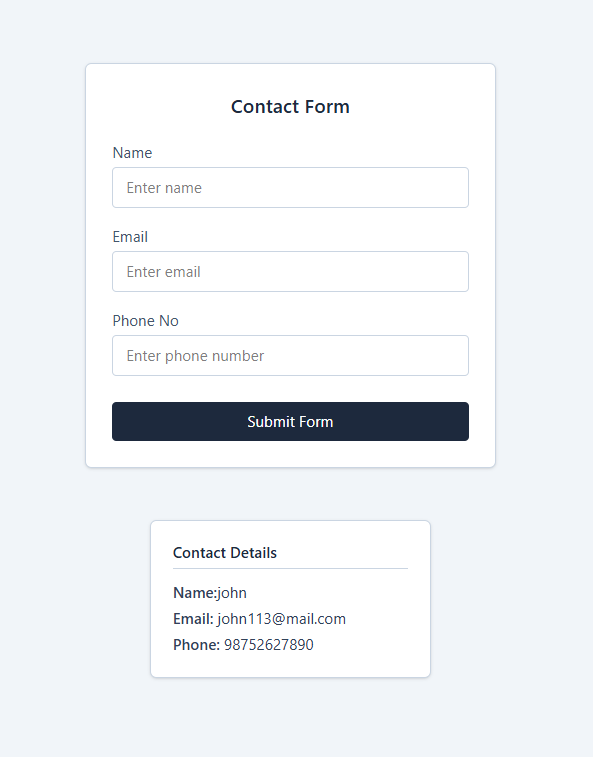

# Contact Form with Dynamic Contact Cards

This project is a simple React application that allows users to enter contact details using a form and display those details dynamically as contact cards.

The main purpose of this project is to understand **React fundamentals**, especially how data flows between components and how shared state is managed.

---

## Screenshot



---

## Features

- User can enter name, email, and phone number
- Form uses controlled inputs
- On submit, details are added as a new contact card
- Multiple contact cards can be created
- Clean and minimal UI using Tailwind CSS

---

## Tech Stack Used

- **React** (Functional Components)
- **React Hooks** (`useState`)
- **Tailwind CSS** (Styling)
- **Vite** (Development environment)

---

## Project Structure

```

src/
│── App.jsx
│── components/
│   ├── Form.jsx
│   └── Card.jsx
│── index.css

```

---

## Component Overview

### App.jsx
- Acts as the parent component
- Holds the shared state (`allUsers`)
- Passes state and setter functions to child components

### Form.jsx
- Handles user input
- Uses controlled inputs
- Sends form data to the parent component on submit

### Card.jsx
- Receives contact data via props
- Renders contact cards dynamically using `map()`

---

## How the Application Works

1. User enters contact details in the form
2. Input values are stored in local state using `useState`
3. On form submission, data is sent to the parent component
4. Parent component updates the `allUsers` array
5. Updated data is passed to the Card component
6. Contact cards are rendered automatically

---

## Concepts Learned

- Controlled components in React
- Handling form submission with `preventDefault`
- Lifting state up to a parent component
- Passing data using props
- Rendering dynamic lists using `map()`
- Understanding React re-rendering
- Debugging common React errors
- Component responsibility and separation

---

## What I Learned From This Project

- How React manages state and re-renders components
- Why shared data should live in the parent component
- How props are used to communicate between components
- How small mistakes like missing props or duplicated state can break the UI
- How to debug and fix runtime errors using the console
```


